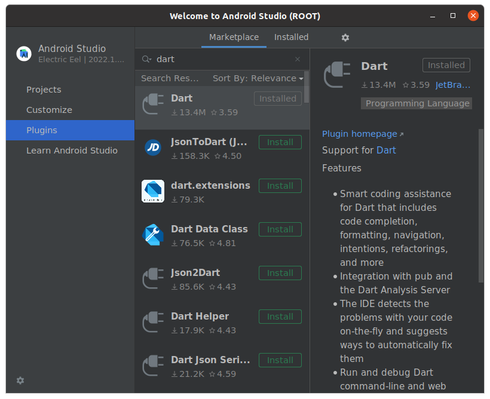
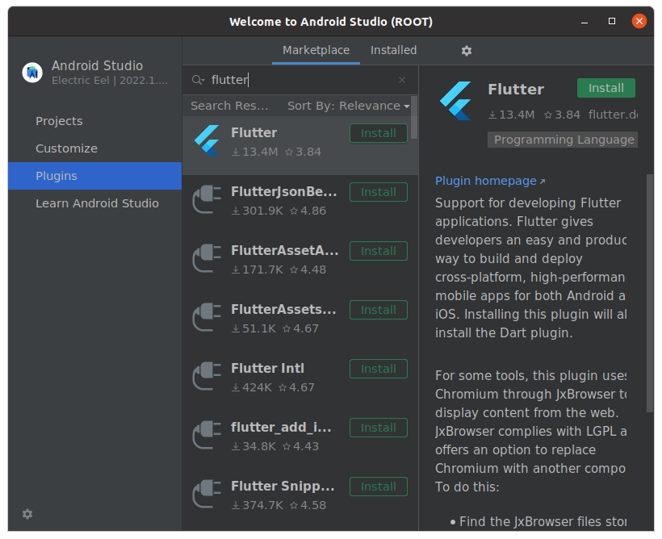
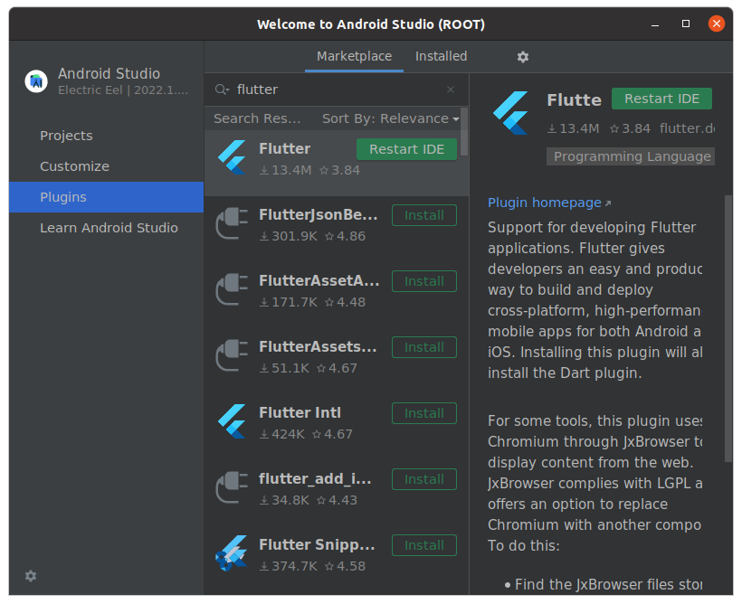
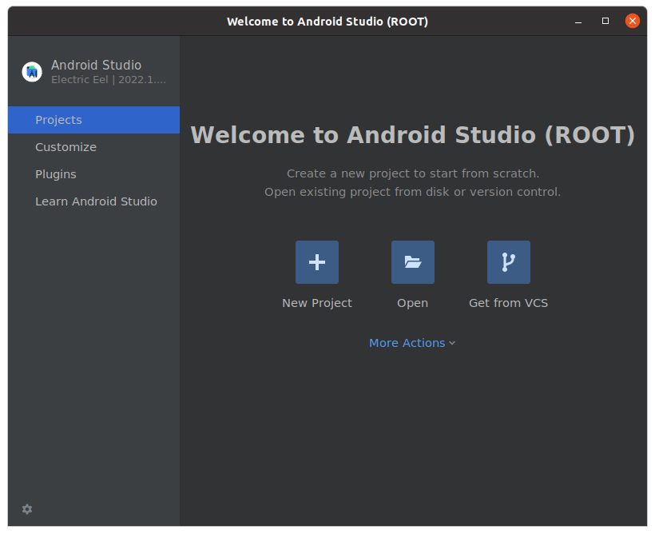
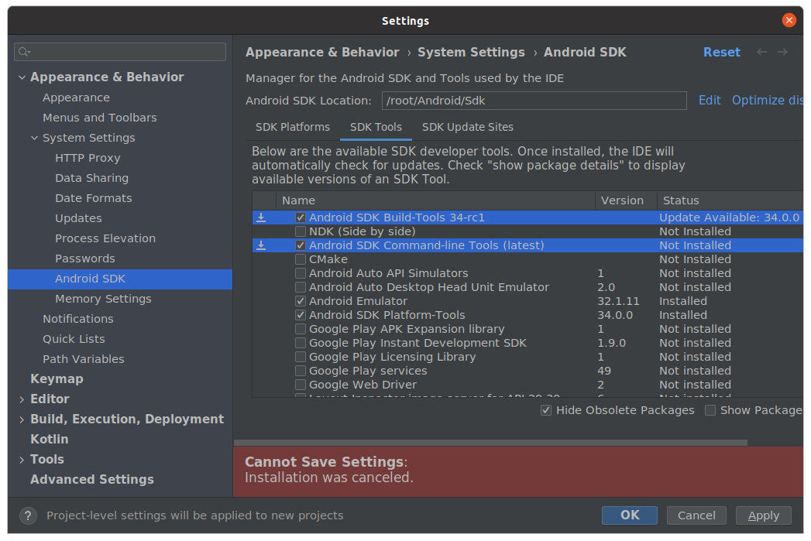
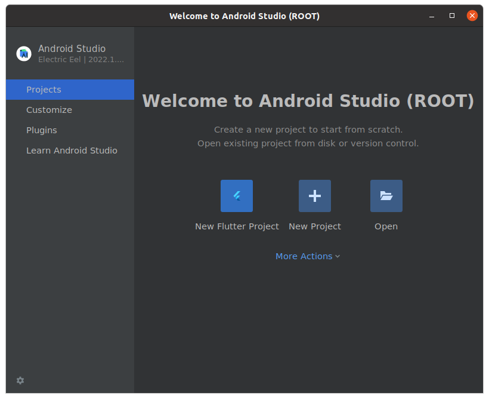
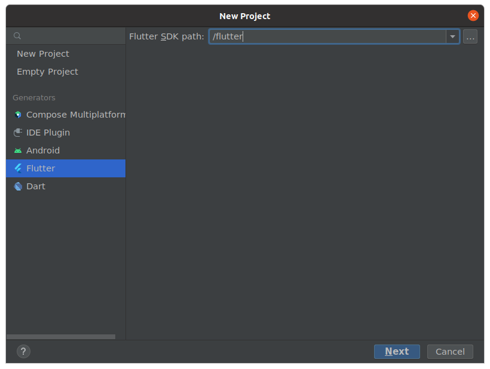
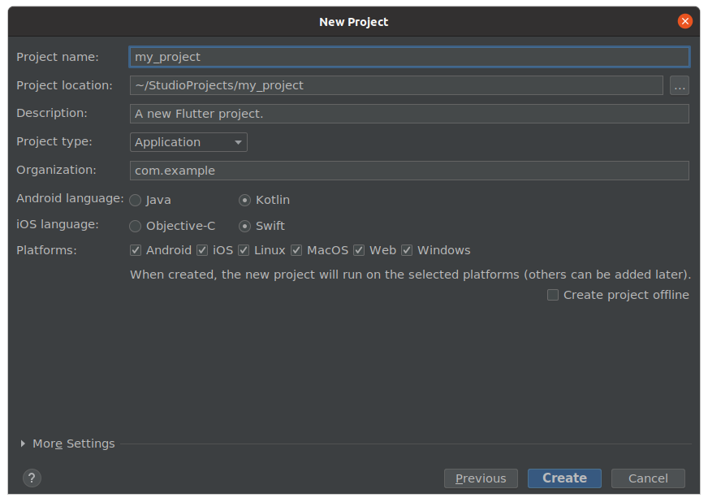

# Launch Android Studio for Flutter apps

## Build docker image
    ```bash
    make build
    ```
## Launch docker image
    ```bash
    make # or make run
    ```

## Configurations
* Follow install proccess.
* Install Dart Plugin:
  
* Install Flutter Plugin:
  
  
* Restart the IDE:
    ```bash
    make # or make run or make res
    ```
* Go to "More Actions" and click on "SDK Manager":
  
* Go To SDK Tools and install:
  * Android SDK Build-Tools
  * Android SDK Command-Line Tools
  
* Create a new Flutter Project:
  
* Select Flutter and set the Flutter SDK Path:
  
* Next and Complete the info.
  
